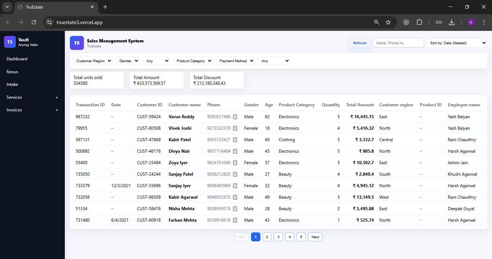
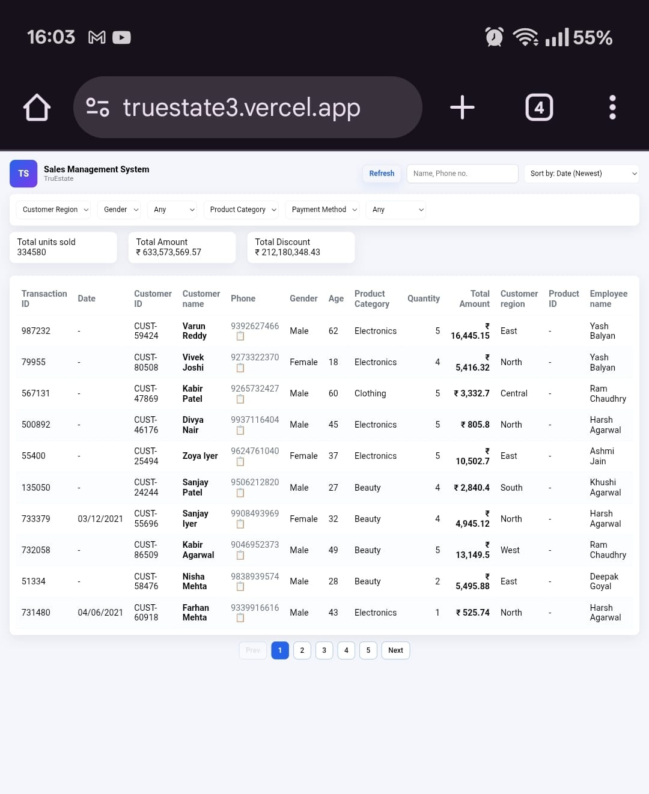
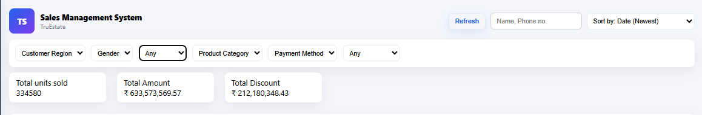
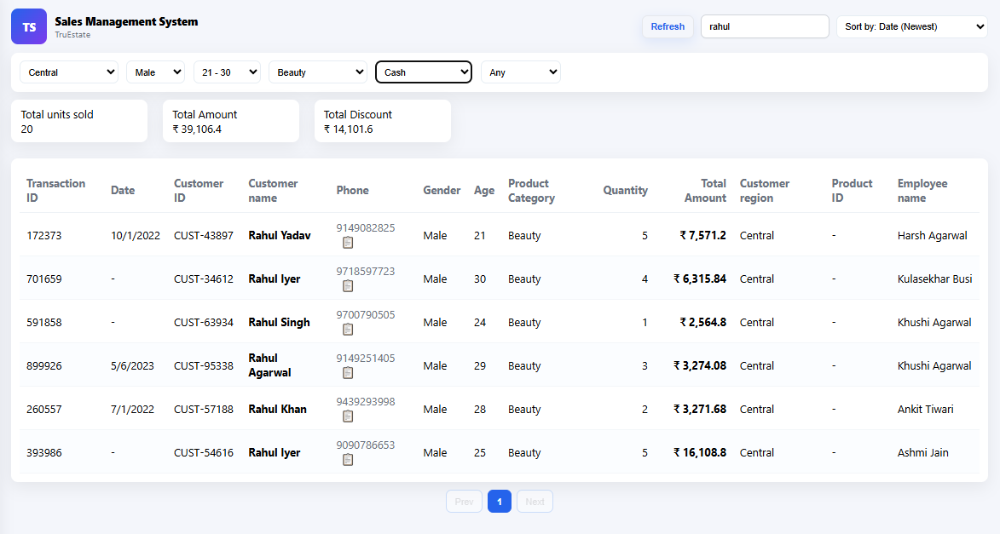
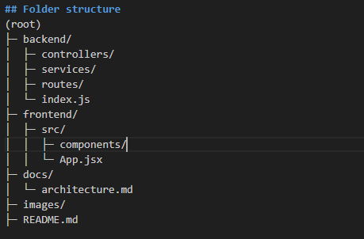

# TruEstate — Retail Sales Management System (Assignment)

A full-stack web application that enables lightning-fast **search**, **multi-filtering**, **sorting**, and **pagination** over retail sales data.  
Built as part of the **TruEstate SDE Intern Assignment**, with production-grade deployment and clean UI inspired by the provided Figma.

---

## 🔗 Live Demo  
[![Live Demo]](https://truestate3.vercel.app/)
[![Record Video]](https://drive.google.com/file/d/1Lq_7nzBnmcs1C84U-9ki63J2G0IaNHqJ/view?usp=sharing)


## 📸 Screenshots

### 🖥️ Desktop View  
<p align="center">
  
</p>

### 📱 Mobile + Filter Panel  
<p align="center">
  
  
</p>

### ⭐ Key UX Highlights
- **Server-side full-text search** across customer name + phone.  
- **Multi-filters**: region, gender, age ranges, tags, and date presets.  
- **Real-time summary cards** auto-update with active filters.  
- **Phone number copy action** (📋) with instant feedback.  

<p align="center">
  
</p>

<p align="center">
  
</p>

---

## 🧱 Architecture  
<p align="center">
  
</p>

---

# 📘 Overview

**TruEstate** is a prototype Retail Sales Management System built to demonstrate:

- Efficient handling of large CSV datasets  
- Production-grade filtering, sorting, and pagination  
- Server + client synchronization  
- Clean UI + UX inspired by a shared Figma design  

---

# 🛠 Tech Stack

### **Backend**
- Node.js  
- Express  
- `csv-parser` (streaming large CSV)  

### **Frontend**
- React  
- Vite  
- Axios  

### **Deployment**
- **Backend:** Render (Web Service)  
- **Frontend:** Vercel  
- CORS, environment variables, and streaming-based CSV load  

---

# 🔍 Search Implementation Summary
- Full-text, case-insensitive search across:
  - **Customer Name**
  - **Phone Number**
- Search performed **server-side** for scalability and accuracy.
- Compatible with filters, sorting, and pagination.

---

# 🎛 Filter Implementation Summary
- **Multi-select filters:** Region, Gender, Product Category, Payment Method, Tags  
- **Age Range filter:** Preset ranges + Custom min/max  
- **Date filter:** Today, Last 7 days, Last 30 days, This Month  
- **Custom date:** Single-date selection (sets `dateFrom = dateTo`)  
- All filters combine using **logical AND**  
- Filter state preserved across pages & sorting  

---

# ↕ Sorting Implementation Summary
- Sort options:
  - **Date** (Newest first)  
  - **Quantity**  
  - **Customer Name** (A–Z)  
- Done **server-side**, compatible with all active filters & pagination.

---

# 📄 Pagination Implementation Summary
- Page size: **10 items**  
- Numbered pages + Next/Previous  
- Pagination respects:
  - search  
  - filters  
  - sort order  
- Fast even on 100k+ row dataset (streaming parse + in-memory index)

---

# ⚙️ Setup Instructions (Local Development)

### 1. Add dataset CSV  
Dataset DownLoad Link :- "https://drive.google.com/file/d/1mO4UZrjoOdtkP64l10YcRIAyQ_BA_Nl-/view?usp=sharing"
Place the CSV file as:  backend/data/sales.csv


### 2. Start backend  
```bash
cd backend
npm install
npm run dev


### 3. Start frontend  
cd frontend
npm install
npm run dev


### 4. OpenApp  
http://localhost:5173


If backend port is busy, start it like:
PORT=5000 npm run dev


Then in frontend .env:
VITE_API_BASE=http://localhost:5000/api


"THANKS"